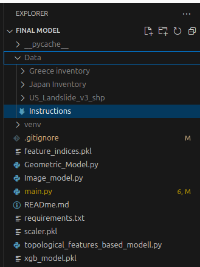
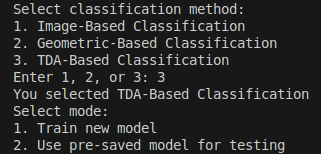
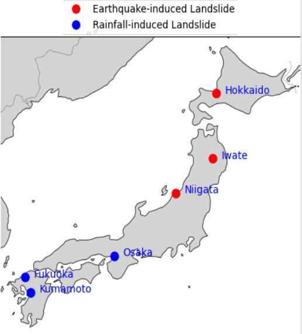
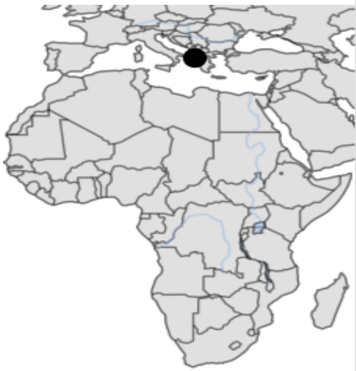
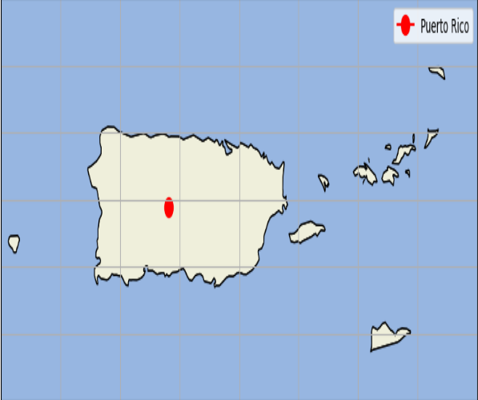
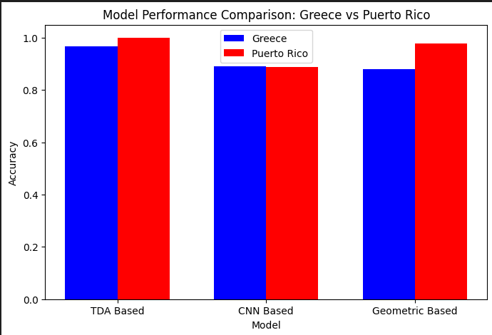

# Landslide Trigger Track

The Landslide Trigger Track provides three different methodologies to classify landslide events:  
1. **TDA-Based Classification (using XGBoost with Topological Data Analysis)**  
2. **Image-Based Classification (using CNN)**
3. **Geometric-Based Classification (using XGBoost)**  


This repository includes a complete pipeline—from data preprocessing and feature extraction to machine learning-based prediction—for classifying landslides triggered as earthquakes or rainfall.

---

## Table of Contents

- [Features](#features)
- [Requirements](#requirements)
- [Installation](#installation)
- [Usage](#usage)
  - [Data Preparation](#data-preparation)
  - [Running the Script](#running-the-script)
  - [Classification Methods](#classification-methods)
- [Screenshots & Demo Video](#screenshots--demo-video)
- [Contributing](#contributing)
- [License](#license)
- [Contact](#contact)

---

## Features

- **Multiple Classification Approaches:**  
  - **CNN-based image classification:** Convert landslide polygons to grayscale images and classify using a pre-trained CNN.
  - **Geometric-based classification:** Extract geometric properties (e.g., area, perimeter) and classify with XGBoost.
  - **TDA-based classification:** Generate 3D point clouds from DEM data, extract topological features, and classify with XGBoost.
  
- **DEM Data Integration:**  
  Automatically downloads and processes Digital Elevation Model (DEM) data required for TDA-based classification.

- **User-friendly Interface:**  
  Interactive command-line prompts guide you through selecting the region and classification method.

- **Model Training & Prediction:**  
  Train new models or use pre-saved ones for rapid prediction.

---

## Key Requirements

- **Python 3.7 or higher**

- **Key Python Packages:**
  - `numpy`
  - `geopandas`
  - `joblib`
  - `matplotlib`
  - `osgeo` (GDAL)
  - `elevation`
  - `scikit-learn`
  - `xgboost`

- **Custom Modules:**
  - `Image_model`
  - `Geometric_Model`
  - `topological_features_based_modell`

> **Note:** Ensure that the above custom modules are included in your repository or accessible via your Python path.

---

# HOW TO RUN THIS ??

 **Step 1 : Clone the Repository:**

   ```bash
   git clone https://github.com/Snehal-Goyal/Landslide_Trigger_Track.git
   cd landslide-classification
   ```

**Step 2 : Create a Virtual Environment (Recommended):**

   ```bash
   python3 -m venv venv
   source venv/bin/activate  # On Windows use: venv\Scripts\activate
   ```

**Step 3 : Install Dependencies:**

   ```bash
   pip install -r requirements.txt
   ```

**Step 4: Set Up Custom Modules:**

   Ensure that the custom modules (`Image_model.py`, `Geometric_Model.py`, and `topological_features_based_modell.py`) are in the same directory as the main script or correctly referenced in your `PYTHONPATH`.

**Step 5 : Download Data**

  To run this project , make sure to download data from the link below and place the downloaded folders in the same " Data " folder 
  Google Drive link : https://drive.google.com/drive/folders/10Pah2Tl9YryNDEwqDL-a0aKwg9oC1i1B?usp=sharing

**Step 6 : Running the Script**

  To run the combined classification system, execute the main Python script:

  ```bash
  python main.py
  ```
Below attached image is the project file structure.

  

---

### On Terminal

Follow the on-screen prompts to select:
- The **classification method** (Image-based, Geometric-based, or TDA-based).
- The **region** for testing (e.g., Greece, US(Puerto Rico)).
- Additional options such as training a new model (for TDA-based classification) or using a pre-saved model.

## Important Point :

When you are running TDA based model for first time , you have to choose "Train new model" , afterwards you can use any of the two options .



## Workflow

The model is trained on Japaense Landslide inventory .Japanese inventory has in total 26501 landslide polygons where
16196 are earthquake induced ( 3256 Hokkaido + 4160 Iwata + 8780 Niigata )
and 10305 are rainfall induced ( 1924 Fukuoka + 5564 Kumamoto +  2817 Osaka)

 

and then the model is tested on Greece Landslide inventory that occur on 14-02-2003 around Greece-Albania border region. 

 
 
 and on US inventory of Sept-2017 at Puerto Rico.

 


#### 1. Image-Based Classification

  - Select region (Greece or US).
  - Load and preprocess shapefile polygons.
  - Convert polygons to grey scale images.
  - Classify using a pre-trained CNN.
  - Visualize sample images and classification results.

#### 2. Geometric-Based Classification

  - Select region.
  - Load shapefiles and extract geometric features.
  - Train or use a pre-trained XGBoost classifier.
  - Display classification results.

#### 3. TDA-Based Classification 

  - Choose to **train a new model** or use an existing one()to save time.
  - Download DEM data if not already present.
  - Create 3D point clouds from polygon geometries.
  - Extract topological features using TDA.
  - Classify using an XGBoost model.
  - Display classification results.

---

## Results

### Comparison of the results obtained from Greece and Puerto Rico



---

## Contributing

Contributions are welcome! If you want to enhance the system, please follow these steps:

1. Fork the repository.
2. Create a new branch: `git checkout -b feature/YourFeatureName`.
3. Commit your changes: `git commit -m 'Add some feature'`.
4. Push to the branch: `git push origin feature/YourFeatureName`.
5. Submit a pull request.

For any issues or suggestions, please open an issue in the repository.

---

## License

This project is licensed under the MIT License - see the [LICENSE](LICENSE) file for details.

---

## Contact

For questions or support, please contact:

- **Snehal** – [snehal@flaxandteal.co.uk](mailto:snehal@flaxandteal.co.uk)
- **Project Link:** [https://github.com/yourusername/landslide-classification](https://github.com/yourusername/landslide-classification)
